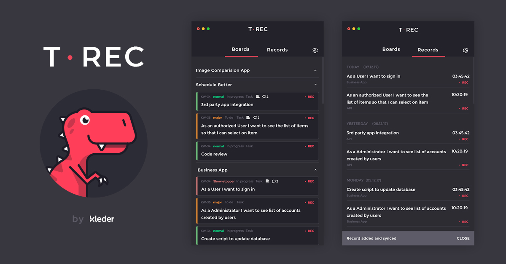

# T-Rec time recording app 

T-REC is a desktop Time RECording app that helps you log your work time into Youtrack. Recorded time entries are automatically synced to InCloud or Standalone Youtrack. 

## Features 
* record time you spend on tasks assigned to you in Youtrack
* track time of your tasks from multiple agile boards  
* detect your idle time and decide what to do with it
* autosync with Youtrack
* work with many Youtrack instances

## Downloads 
The Windows (x64)/ Linux (x64) and Mac binaries are avaible on [Release](https://github.com/kleder/timetracker/releases/latest) page.

## Getting started

### Obtain Youtrack token for app 

To start using T-REC you need to obtain the permament token for your personal Youtrack account. Follow this instruction to get one: https://www.jetbrains.com/help/youtrack/standalone/Manage-Permanent-Token.html

In case you don't see the "New Token" button make sure that you have **Read Service** and **Update self** permissions to issue a token in one of your Youtrack roles.  

### Before run

Before the first run of the app create an agile board with tasks assigned to you and schedule a sprint. Follow this instruction to get more info: https://www.jetbrains.com/help/youtrack/standalone/Agile-Board.html

### First run

Once you run T-REC add Youtrack account by entering your Youtrack URL and personal token.
Then select boards you'd like to work with. Finally you may start recording the work you do with your tasks

### Remarks
T-REC allows you to view your tasks which belong to the correctly scheduled current sprint on agile board. T-REC will not display the task if it is not part of the sprint or is not assigned to you.

## Development and contribution
To compile source code see [CONTRIBUTING](CONTRIBUTING.md) file

## License
Apache 2.0
